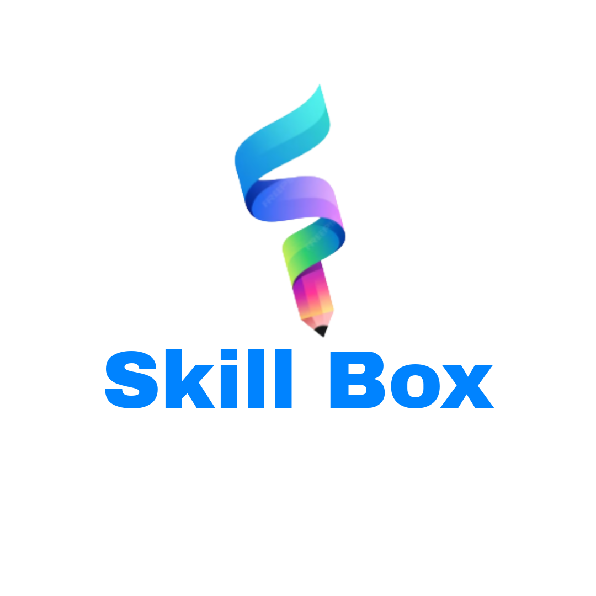

# 📚 SkillBox - Learning Platform

<div align="center">
  
  
  **Empowering Learning Through Technology**
  
  [](https://reactnative.dev/)
  [](https://expo.dev/)
  [](https://www.typescriptlang.org/)
  [](https://supabase.com/)
</div>

## 🌟 About SkillBox

SkillBox is a comprehensive learning platform that connects learners with expert creators, offering a diverse range of educational content including video tutorials, live classes, structured courses, and interactive learning experiences. Our platform empowers both learners to acquire new skills and creators to share their expertise with a global audience.

## ✨ Key Features

### 🎓 For Learners
- **Diverse Learning Content**: Access thousands of video tutorials, articles, and interactive courses
- **Live Classes**: Participate in real-time interactive sessions with expert instructors
- **Structured Learning Paths**: Follow curated courses designed for progressive skill development
- **Gamified Experience**: Earn points, badges, and achievements to stay motivated
- **Progress Tracking**: Monitor your learning journey with detailed analytics
- **Community Engagement**: Connect with fellow learners and creators
- **Personalized Recommendations**: Discover content tailored to your interests and goals

### 👨‍🏫 For Creators
- **Content Creation Tools**: Upload videos, create articles, and build comprehensive courses
- **Live Class Hosting**: Schedule and conduct interactive live sessions
- **Creator Dashboard**: Comprehensive analytics and earning insights
- **Flexible Monetization**: Set your own pricing for premium content
- **Community Building**: Engage with your audience through comments and discussions
- **Verification System**: Build credibility with our creator verification program

### 🎯 Core Capabilities
- **Multi-format Learning**: Support for videos, articles, courses, and live classes
- **Advanced Search**: Find content by skills, difficulty level, creator, and more
- **Social Learning**: Follow creators, bookmark content, and share knowledge
- **Achievement System**: Gamified learning with points, streaks, and badges
- **Notification System**: Stay updated on new content, classes, and community activity
- **Support & Feedback**: Comprehensive help system with multiple support channels

## 🚀 Technology Stack

### Frontend
- **React Native** with Expo for cross-platform mobile development
- **TypeScript** for type-safe development
- **Expo Router** for navigation and routing
- **React Native Reanimated** for smooth animations
- **Expo Image** for optimized image handling

### Backend & Database
- **Supabase** for backend-as-a-service
- **PostgreSQL** as the primary database
- **Row Level Security (RLS)** for data protection
- **Real-time subscriptions** for live features

### Key Libraries
- **@expo/vector-icons** for comprehensive icon support
- **React Native Gesture Handler** for touch interactions
- **Expo AV** for media playback
- **React Hook Form** for form management

## 📱 Getting Started

1. **Install dependencies**
   ```bash
   npm install
   ```

2. **Set up environment variables**
   ```bash
   cp .env.example .env
   # Add your Supabase URL and keys
   ```

3. **Run database migrations**
   ```bash
   # Import the schema.sql file into your Supabase project
   ```

4. **Start the development server**
   ```bash
   npx expo start
   ```

## 📱 Supported Platforms

- **iOS** (iPhone and iPad)
- **Android** (Phones and Tablets)
- **Web** (Progressive Web App)

## 🎨 User Experience

SkillBox features a modern, intuitive interface designed for seamless learning:

- **Dark/Light Theme Support**: Comfortable viewing in any environment
- **Responsive Design**: Optimized for all screen sizes and orientations
- **Accessibility**: Built with accessibility best practices
- **Smooth Animations**: Fluid transitions and micro-interactions
- **Offline Capabilities**: Download content for offline learning

## 🔐 Security & Privacy

- **End-to-End Encryption**: Secure data transmission
- **Privacy Controls**: Granular privacy settings for users
- **Secure Authentication**: Multi-factor authentication support
- **Data Protection**: GDPR and privacy regulation compliant
- **Content Moderation**: AI-powered content review system

## 📊 Database Schema

The complete database schema is available in `/database/schema.sql` and includes:

- **User Management**: Complete user profiles and authentication
- **Content System**: Videos, articles, courses, and live classes
- **Learning Tracking**: Progress monitoring and analytics
- **Social Features**: Following, comments, and community
- **Gamification**: Achievements, points, and streaks
- **Payment System**: Transactions and creator earnings
- **Support System**: Tickets, feedback, and help

## 🌍 Global Reach

- **Multi-language Support**: Interface available in multiple languages
- **Currency Support**: Multiple payment currencies
- **Regional Content**: Localized content recommendations
- **Time Zone Aware**: Smart scheduling for global live classes

## 📞 Support

Need help? We're here for you:

- **In-App Support**: Access help directly from the application
- **Knowledge Base**: Comprehensive documentation and FAQs
- **Community Forums**: Connect with other users
- **Direct Support**: Contact our support team for personalized assistance

## 🎯 Mission Statement

Our mission is to democratize education by making high-quality learning accessible to everyone, everywhere. We believe that knowledge should have no boundaries, and we're committed to building tools that empower both learners and educators to achieve their full potential.

---

**Join thousands of learners and creators on SkillBox - where knowledge meets opportunity!**
